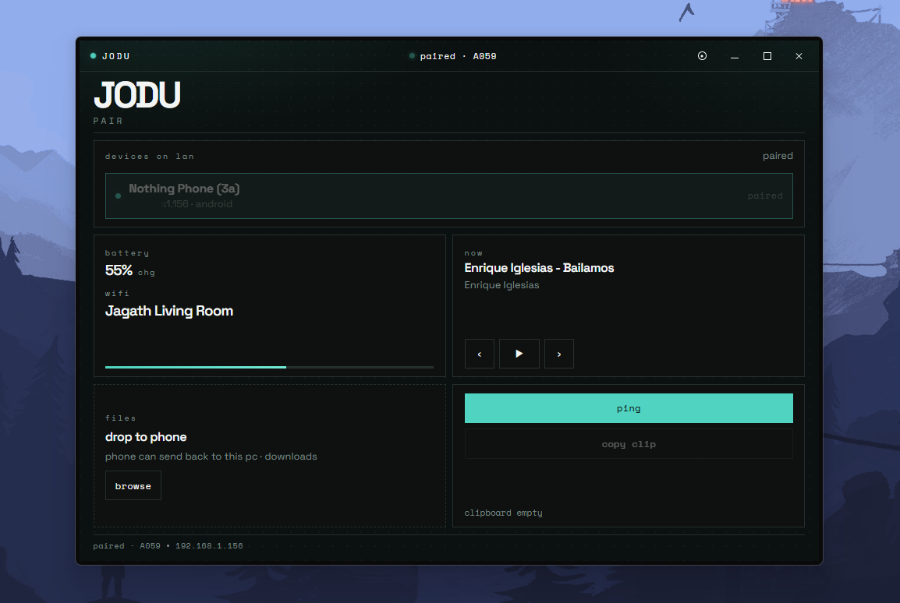
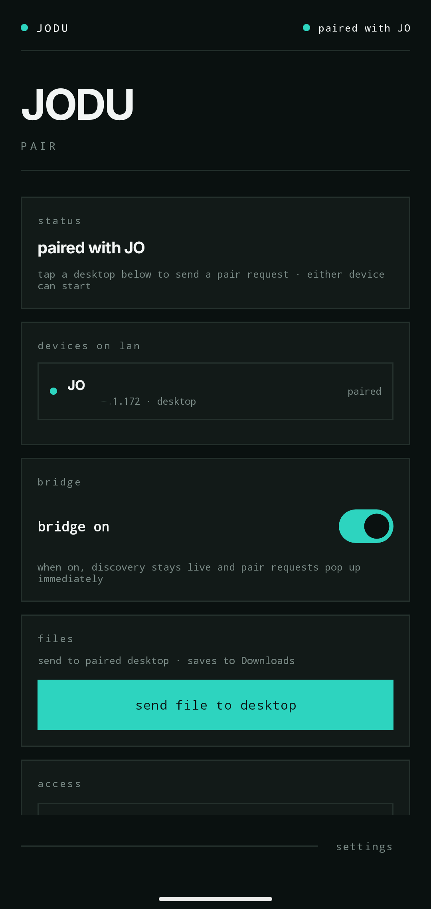

# JODU docs

Index for project documentation.

| Doc | Description |
|-----|-------------|
| [Architecture](architecture.md) | Components, discovery, and data flow |
| [Protocol](protocol.md) | WebSocket / HTTP message contracts |
| [Desktop](desktop.md) | .NET host, Vite UI, run scripts |
| [Android](android.md) | Kotlin app, permissions, services |
| [Troubleshooting](troubleshooting.md) | Common setup and LAN issues |
| [Roadmap](roadmap.md) | To implement — planned features |
| [Style reference](style-reference.md) | Nothing OS tokens (from dasa-utility) |

## Screenshots

| Desktop | Android |
|---------|---------|
|  |  |

## Repo layout

```
JODU/
├── android/       # Kotlin Android client
├── desktop/       # .NET 10 + WebView2 + Vite React UI
├── docs/          # This documentation
│   └── media/     # Screenshots
├── run-desktop.ps1
└── README.md
```
