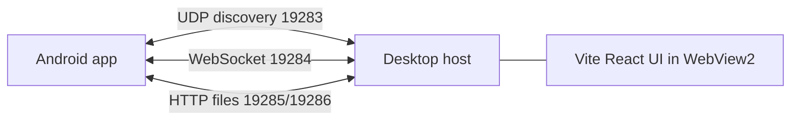

# Architecture

JODU is a **zero-cloud**, local Wi-Fi bridge between an Android phone and a Windows desktop.

## Components

| Piece | Role |
|-------|------|
| `desktop/` | Tray app, WebSocket server, file HTTP receiver, hotkeys, toasts |
| `desktop/ui/` | Single-page React UI (status, media, files, ping, settings) |
| `android/` | Foreground service, clipboard, OTP listener, media, telemetry, ping |

## Discovery & pairing

Both sides broadcast UDP `DISCOVERY` packets on port **19283** and show found peers in the UI.

Either device can tap a peer to send `PAIR_REQUEST`. The other device accepts or declines with `PAIR_RESPONSE`.

After accept:

1. Phone opens WebSocket client to the desktop (`ws://{ip}:19284/`)
2. Clipboard / telemetry / media / OTP / ping flow over that socket

## Runtime channels

1. **WebSocket** — clipboard, telemetry, OTP, media, ping
2. **HTTP POST `/upload`** — file streams (`X-Filename` header)
3. **UDP** — discovery only

## Desktop window shell

- Borderless WinForms host with custom React title bar
- Drag / min / max / close via WebView2 `postMessage`
- Close hides to tray; quit from tray menu
